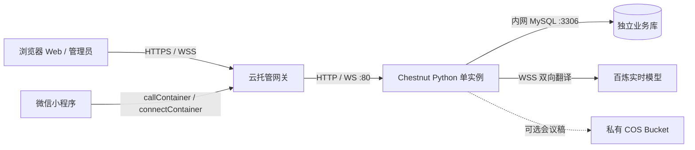

# 微信云托管部署与配置

此版本共用一套 Python 服务：Web 会议页、小程序 HTTP/WebSocket 接口，以及仅提供 Web 界面的管理后台。本地默认 SQLite + 文件；云端使用独立 MySQL，会议稿默认也保存在 MySQL。云端不会读取、上传、导入或同步本地 SQLite、管理员密码、邀请码、记录和会议稿。

完整变量模板是根目录 `.env.example`，云端最小模板为 `.env.cloud.example`。真实 `.env`、`.env.local`、`.env.cloud` 均被 Git 和 Docker 排除。不要用模板覆盖已有 `.env`；已有配置只需补充新增项。

## 1. 部署结构与当前边界



- **本版本按单实例运行**：最小实例数 1、最大实例数 1，单进程 `python server.py`。试用状态、登录/重连限流、在线会议表仍在进程内；不要开启多副本、多个 worker 或多个版本分流。MySQL 事务保证邀请码额度不会被两个数据库连接重复扣减，但这不代表整个服务已经支持水平扩容。
- 发布时安排会议空闲窗口，先结束旧版本业务流量，再让新版本接入；不要依赖跨版本重连或无感发布。进程重启会终止实时连接、清空短期试用状态。邀请码、后台登录会话、统计和已保存的会议稿保留。
- 试用限制延续原产品要求：成功连接翻译后计时，默认 180 秒；暂停和重连不会续时；同一客户端短期内不能重复领取；记录最多记住约 6 小时。它不是长期身份或设备反作弊系统。
- 后台入口为 `https://你的域名/admin`；小程序不提供后台页面或管理入口，微信身份和会议邀请码都不能代替管理员密码。
- 本地管理员启动器继续限定 `127.0.0.1`，并强制 SQLite + 本地会议稿，即使 `.env` 填有云端数据库参数，也不会因此切换到云库。

以后扩容需要先将试用额度、在线会议租约与限流状态迁入共享存储，再验证跨实例的重连、撤权和试用保存幂等性。

## 2. 准备 MySQL

已提供的连接地址：

| 场景 | 主机 | 端口 |
| --- | --- | --- |
| 微信云托管容器，正式使用 | `10.34.104.109` | `3306` |
| 本地电脑联调、初始化、排障 | `sh-cynosdbmysql-grp-9zp4wms6.sql.tencentcdb.com` | `27839` |

数据库名采用 `chestnut`，可通过 `CHESTNUT_MYSQL_DATABASE` 改名。IP 和端口不是库名。需要在云控制台核实服务与数据库所在地域、VPC 和子网连通关系；外网连接按当前实例的安全组/访问白名单限制来源。正式服务使用内网地址。[腾讯云 MySQL 内网接入说明](https://cloud.tencent.com/document/product/1243/49231)

已有 `.env` 中的 `CHESTNUT_CLOUD_DB_ADMIN`、`CHESTNUT_CLOUD_DB_PASSWORD` 继续有效。新配置推荐使用 `CHESTNUT_MYSQL_USER`、`CHESTNUT_MYSQL_PASSWORD`；新变量非空时优先，不必重复填写密码。

安装依赖后，可先只读检查连接：

```powershell
.\.venv\Scripts\python.exe -m pip install -r requirements.txt
.\.venv\Scripts\python.exe scripts/mysql_database.py --host sh-cynosdbmysql-grp-9zp4wms6.sql.tencentcdb.com --port 27839 --database chestnut
```

确认是本项目的独立业务库后，初始化空库和表：

```powershell
.\.venv\Scripts\python.exe scripts/mysql_database.py --host sh-cynosdbmysql-grp-9zp4wms6.sql.tencentcdb.com --port 27839 --database chestnut --create-database
```

初始化使用 `CREATE ... IF NOT EXISTS`，可重复执行，不清空表、不设置或重置管理员密码、不导入本地数据。服务启动会自动创建缺少的表，但不会自动创建数据库。连接失败、缺库或权限不足会启动失败，不会静默退回 SQLite 或匿名模式。

建议通过云控制台建立仅授权该库的应用账号，运行/建表需要 `SELECT, INSERT, UPDATE, DELETE, CREATE, INDEX`。初始化数据库需要额外建库权限；不必向运行账号授予整个实例的管理权限。真实集成测试需要能创建和删除其专属临时库的测试账号。

MySQL 要求 8.0，字符集 `utf8mb4`、InnoDB。建议检查 `max_allowed_packet` 至少为 16 MB，支持上限 5 MB 的会议稿请求及生成的 Markdown。服务器只存文本，不存原始音频。MySQL 使用 UTC 时间戳，后台报表继续按北京时间日界线统计，无需修改数据库全局时区。

通过公网联调时，可在云控制台开启数据库 SSL，并将服务端 CA 文件路径填写到 `CHESTNUT_MYSQL_SSL_CA`。配置 CA 后驱动同时验证证书及连接主机名；使用与证书匹配的域名，不要关闭验证来绕过错误。[PyMySQL 连接参数说明](https://pymysql.readthedocs.io/en/latest/modules/connections.html)

## 3. 本地调试

### 3.1 原有 SQLite 工作流

继续使用已有 `.env` 与本地数据：

```powershell
.\.venv\Scripts\python.exe scripts/start_admin_local.py
```

浏览器访问 `http://127.0.0.1:8080`，后台访问 `http://127.0.0.1:8080/admin`。启动器自动读取 `.env`，保留已有本地管理员密码。手机局域网调试使用下一种直接启动方式，将监听地址设为 `0.0.0.0`；不要用限定回环地址的管理启动器给手机提供服务。

### 3.2 本地用 MySQL 联调

推荐另建 `.env.mysql`，不要把正在使用的本地配置改成云端配置：

```dotenv
CHESTNUT_ENV="local"
CHESTNUT_DATABASE_BACKEND="mysql"
CHESTNUT_TRANSCRIPT_STORAGE="mysql"
CHESTNUT_HOST="127.0.0.1"
CHESTNUT_PORT="8081"
CHESTNUT_ADMIN_ENABLED="1"
CHESTNUT_MYSQL_HOST="sh-cynosdbmysql-grp-9zp4wms6.sql.tencentcdb.com"
CHESTNUT_MYSQL_PORT="27839"
CHESTNUT_MYSQL_DATABASE="chestnut_dev"
CHESTNUT_MYSQL_USER="填写账号"
CHESTNUT_MYSQL_PASSWORD="填写密码"
DASHSCOPE_API_KEY="填写百炼 Key"
BAILIAN_API_HOST="填写业务空间 Host"
```

本地联调建议使用独立 `chestnut_dev` 库。选择 `chestnut` 就是在直接修改正式业务库，而不是数据同步。先用初始化脚本 `--env-file .env.mysql --create-database` 建立所选库，再启动：

```powershell
$env:CHESTNUT_ENV_FILE='.env.mysql'
.\.venv\Scripts\python.exe server.py
```

结束后 `Remove-Item Env:CHESTNUT_ENV_FILE` 取消本终端的文件选择。`python server.py` 读取所选配置文件后才初始化参数；导入 `server` 的测试代码不会自行加载开发密钥。未指定文件时使用项目根目录 `.env`。系统中已设置的非空环境变量优先于文件。

### 3.3 小程序调试与发布

编辑 `miniprogram/config/environment.js`：

| 配置 | 用途 |
| --- | --- |
| `TRANSPORT_MODE` | `auto`：开发版用本地/LAN，体验版/正式版用云；`local`：强制本地；`cloud`：强制云，适合开发工具联调云端 |
| `DEFAULT_SERVER_HOST` | 本地默认主机；手机测试用电脑局域网 IP，也可在现有页面里修改服务地址 |
| `HTTP_PORT` | 本地 HTTP/WS 端口，默认 8080，须与 Python 监听端口一致 |
| `CLOUD_ENV_ID` | 实际微信云托管环境 ID，是公开客户端配置，不是密钥 |
| `CLOUD_SERVICE` | 云托管服务名，当前约定 `chestnut-api` |

确认小程序 AppID 与云托管环境关联、服务调用权限已开启。云端仍使用 `wx.cloud.callContainer` 和 `wx.cloud.connectContainer`，不在小程序中保存 MySQL、百炼或管理员凭据。Web 使用 HttpOnly Cookie，小程序使用 Bearer token / WebSocket 首帧认证，token 不放在 WebSocket URL。

微信网关注入的 `X-WX-OpenID` 仅在来源 IP 属于 `CHESTNUT_TRUSTED_PROXY_CIDRS` 时被信任。填写真实网关出口地址/网段，并确认网关覆盖客户端自带的身份头；不要把公网来源或任意网络都设为可信。未配置时小程序仍可按签名客户端凭证使用服务，但不会获得可信 OpenID 绑定。

## 4. 微信云托管发布步骤

配置运行时环境变量后，重新部署并检查新版本的启动日志。若使用 Git 推送触发部署，可提交一处文档更新；以新版本部署结果确认配置生效，避免将旧版本日志误认为本次结果。

排查发布结果时，同时核对构建来源的 Git 提交号、部署版本号和该版本日志。旧容器持续重启也会产生新的日志时间；仅看时间不能确认最新代码已经部署。

### 版本日志与提交标记

服务的第一条标准输出是 JSON 日志 `event=service_starting`，在加载 `.env`、解析端口、导入服务依赖和连接数据库之前输出。它只表示尝试启动；监听成功仍以 `event=service_started` 为准。本地管理员启动器也遵循这一顺序。

每次提交使用以下命令（先暂存本次需要提交的文件）：

```powershell
.\.venv\Scripts\python.exe scripts/commit_version.py -m "本次改动说明"
git push --follow-tags origin main
```

脚本将 `VERSION.json` 与代码一起提交，并创建指向该提交的附注 Git 标签。后续提交继续使用此脚本，避免沿用旧标记。Git 原生提交时间精确到秒；脚本固定本次提交时间并写入 `commit_time_utc`，另外用 `stamped_at_utc` 记录微秒级版本生成时间。两者均为 UTC（北京时间加 8 小时）。日志字段：

| 字段 | 用途 |
| --- | --- |
| `version` / `code_ref` | 唯一时间戳版本号及 Git 标签，云镜像没有 `.git` 也能查询准确提交 |
| `commit_time_utc` / `stamped_at_utc` | 秒级 Git 提交时间 / 微秒级版本生成时间 |
| `source_sha256` | 暂存区文件路径、模式和 Git 内容对象 ID 的 SHA-256；排除自引用的 `VERSION.json` |
| `built_at_utc` | Docker 构建版本信息层的时间；同一层命中缓存时保留原值，本地通常为 `local` |
| `time_utc` | 当前进程输出日志的时间，容器每次重启都会变化 |
| `git_commit` / `working_tree_dirty` | 本地存在 Git 元数据时额外输出当前提交 SHA 和工作区是否有修改 |

从日志复制 `code_ref`，运行 `git show --no-patch <code_ref>` 即可找到完整提交 SHA 和说明。云端使用随镜像保存的标签和指纹，无需添加版本环境变量，也不上传 `.git`。可运行 `python version_info.py` 查看当前版本元数据。

所有应用日志均带 `version` 和每次进程启动随机生成的 `boot_id`，时间统一为 UTC，日志统一写标准输出。`startup_stage_started/completed/failed` 区分配置文件、配置校验、MySQL/SQLite、管理员初始化；失败包含阶段、异常类型和耗时。数据库另有固定错误码提示，凭据只记录是否配置，不记录值。`application_ready` 表示路由组装完成，`service_started` 才表示已监听。后台被拒绝时记录 `admin_access_denied`，区分后台关闭、微信身份头、仅限本机等原因；每个进程同类原因只记录一次。

HTTP 响应（包括 404、503）包含 `X-Chestnut-Version` 和 `X-Chestnut-Boot-ID`。`/health` 返回相同版本、源码指纹、构建时间、数据库检查结果并禁止缓存；数据库检查失败返回 503，只在状态改变时记录日志。这样旧版本的健康 200 不会被误认作新版本上线。

每次推送后执行只读验收：

```powershell
.\.venv\Scripts\python.exe scripts/verify_deployment.py --origin https://chestnut-api-305195-11-1477663536.sh.run.tcloudbase.com --attempts 12 --interval 20
```

验收要求 `/health`、首页、`/app.js`、`/admin`、后台会话接口均返回当前 `VERSION.json` 的版本标记，数据库健康且后台运行在云模式。只有全部通过才退出 0。健康检查 200 但版本不符、页面 404 或新旧版本混合都判为尚未完成部署；需核对云托管构建来源、发布结果和入口流量分配。验收不会登录后台或修改业务数据。它不验证百炼实时翻译和手机录音链路。

### 配置与发布

本项目当前可先尝试使用以下云托管 HTTPS 地址作为 Web 入口；将此键和值分别填写到**云托管待部署版本的运行时环境变量**中（不是只修改电脑上的 `.env`）：

```dotenv
CHESTNUT_PUBLIC_ORIGIN=https://chestnut-api-305195-11-1477663536.sh.run.tcloudbase.com
```

值不带 `/admin`、`/health` 或路径。对应后台入口是在该地址后加 `/admin`。配置此值不会自动启用云服务的公网访问，仍需确认平台已开放该入口。计划使用的 `www.myone.bj.cn` 应先在云托管配置域名绑定和 HTTPS 证书，确认 `https://www.myone.bj.cn` 可访问服务，再把此变量改为该 HTTPS 源。仅 HTTP 的公网地址不适合浏览器录音和 Secure Cookie 登录。

1. 按第 2 节建立业务库和应用账号。配置服务与数据库的内网连通。
2. 绑定 Web 使用的 HTTPS 域名，确定 `CHESTNUT_PUBLIC_ORIGIN`。浏览器麦克风与 Secure Cookie 都要求正式站点使用 HTTPS。HTTP 入口由网关重定向至 HTTPS。
3. 参考 `.env.cloud.example`，在云托管控制台/密钥管理配置中逐项注入环境变量；值不带 `.env` 语法的包围引号。必填项是百炼两项、MySQL 连接信息、实际 HTTPS Origin、随机签名密钥和首次管理员密码。模板域名和空密码不能直接发布。
4. 以项目根目录为构建目录，使用 `Dockerfile`，内部端口 **80**，启动命令 `python server.py`。镜像默认 `CHESTNUT_ENV=cloud`、`PORT=80`，以非 root 用户运行，通过 `NET_BIND_SERVICE` 绑定低端口；构建时会用该用户实际验证 80 端口绑定。云托管容器端口、就绪探针、存活探针和 `PORT` 必须一致。如果控制台仍有旧的 `PORT=8080`，改成 `80` 或删除该覆盖值。本地默认仍为 8080。不要打包 `.env`、`data`、`meetings` 和日志。[Docker 端口绑定能力说明](https://docs.docker.com/engine/security/)
5. 实例最小/最大都设为 1，保持一个接收业务流量的版本。HTTP 健康检查使用 `/health`，启动预留至少 30 秒；健康检查会探测 MySQL，数据库不可达时返回 503。
6. 开启网关 WebSocket 支持，确认服务具有访问百炼公网 WSS 的出口。服务已每 10 秒发送 WebSocket 心跳。平台连接时限、空闲回收规则以当前云托管控制台为准，发布前通过真实小程序和浏览器验证长连接。[云托管 WebSocket 接入](https://docs.cloudbase.net/run/develop/access/websocket)
7. 首次启动从 `CHESTNUT_ADMIN_BOOTSTRAP_PASSWORD` 设置独立管理员密码，保存 PBKDF2 哈希。之后可删除该环境变量。修改此变量不会覆盖现有密码；云端不开放 `/api/admin/setup`。
8. 登录 `https://你的域名/admin`，生成一个短期邀请码；分别验证 Web 和小程序的试用、邀请码、翻译与会议稿保存。重启服务后确认邀请码、后台会话和已保存稿件仍在。

签名密钥可在可信本机生成，将输出仅粘贴到私密配置中：

```powershell
.\.venv\Scripts\python.exe -c "import secrets; print(secrets.token_urlsafe(48))"
```

`CHESTNUT_AUTH_SECRET` 应长期保持不变；修改后已签发的会议凭证会失效。不要把它复用为管理员密码或数据库密码。

## 5. 环境变量逐项说明

### 运行、管理与数据库

| 变量 | 默认 / 必填情况 | 用途 |
| --- | --- | --- |
| `CHESTNUT_ENV` | 本地 `local`，镜像 `cloud` | 选择安全边界；云端强制 MySQL 和 HTTPS Origin |
| `CHESTNUT_ENV_FILE` | 根目录 `.env` | 本地启动时选择私密配置文件，需在系统环境中设置 |
| `CHESTNUT_DATABASE_BACKEND` | 本地 `sqlite`，云端 `mysql` | 数据层选择；MySQL 不导入静态码或本地库 |
| `CHESTNUT_HOST` | 本地 `127.0.0.1`，镜像 `0.0.0.0` | 监听地址；手机访问需监听局域网 |
| `CHESTNUT_PORT` | 本地 `8080`、云端 `80` | HTTP/WS 共用端口 |
| `PORT` | 镜像 `80` | 优先于 `CHESTNUT_PORT`；容器健康检查读取 PORT，默认 80；须与平台容器及探针端口一致 |
| `CHESTNUT_LOCAL_ADMIN_PORT` | 未设置 | 本地管理启动器端口，优先于 `PORT` |
| `CHESTNUT_ADMIN_ENABLED` | 程序本地 `0`、模板 `1`、云端 `1` | 开关 Web 后台；关闭后台不会取消 MySQL 邀请保护 |
| `CHESTNUT_ADMIN_DB` | `data/admin.sqlite3` | 本地 SQLite 文件；MySQL 模式忽略 |
| `CHESTNUT_ADMIN_BOOTSTRAP_PASSWORD` | 云端首次开启后台必填 | 12–200 字符，只设置一次；已有密码不覆盖 |
| `CHESTNUT_MYSQL_HOST` | MySQL 必填 | 单独主机名/IP，不包含端口或协议 |
| `CHESTNUT_MYSQL_PORT` | `3306` | 1–65535；提供的公网映射端口是 27839 |
| `CHESTNUT_MYSQL_DATABASE` | `chestnut` | 独立业务库名称，须预先创建 |
| `CHESTNUT_MYSQL_USER` | MySQL 必填，可由旧变量替代 | 仅授权业务库的账号 |
| `CHESTNUT_MYSQL_PASSWORD` | MySQL 必填，可由旧变量替代 | 对应账号密码 |
| `CHESTNUT_CLOUD_DB_ADMIN` | 兼容旧配置 | 仅新 USER 为空时作为数据库用户名 |
| `CHESTNUT_CLOUD_DB_PASSWORD` | 兼容旧配置 | 仅新 PASSWORD 为空时作为数据库密码 |
| `CHESTNUT_MYSQL_TIMEOUT_SECONDS` | `10` | 1–60 秒，连接/读取/写入超时；失败不自动重放事务 |
| `CHESTNUT_MYSQL_SSL_CA` | 空 | CA 文件路径；非空开启严格证书及主机名校验 |

### 安全、访问和额度

| 变量 | 默认 / 必填情况 | 用途 |
| --- | --- | --- |
| `CHESTNUT_PUBLIC_ORIGIN` | 云端必填 | 唯一 Web HTTPS 源，例如 `https://meet.example.com`，不带路径；管理写操作还需 CSRF token |
| `CHESTNUT_TRUSTED_PROXY_CIDRS` | 空 | 逗号分隔的可信网关 IP/CIDR；解析转发 IP、接受平台 OpenID。默认忽略云端未受信任的身份头 |
| `CHESTNUT_AUTH_SECRET` | 云端必填，至少 32 字符 | 用户凭证 HMAC 密钥；本地数据库模式留空时用库内生成的密钥 |
| `CHESTNUT_WEB_TOKEN_TTL_SECONDS` | `43200` | 邀请凭证有效秒数，必须大于 0；到期/禁用邀请码仍可提前撤权 |
| `CHESTNUT_WEB_INVITE_CODES` | 空 | 兼容旧静态码 `标签=码,标签=码`；仅本地/旧流程使用，云端管理码在 MySQL 中生成 |
| `CHESTNUT_ALLOWED_ORIGINS` | 空 | 旧本地模式 Origin 白名单，逗号分隔；云端使用 PUBLIC_ORIGIN，不做跨站 Cookie/CORS 管理 |
| `CHESTNUT_TRIAL_SECONDS` | `180` | 0 关闭，最大 900 秒；试用 token 1 小时，实际翻译权限以服务端倒计时为准 |
| `CHESTNUT_MAX_MEETING_SECONDS` | `3600` | 受保护会议的单场上限，0 不限；本地匿名桌面不应用此限制 |
| `CHESTNUT_MEETING_WARNING_SECONDS` | `300` | 普通会议到期前提醒秒数 |
| `CHESTNUT_MAX_CONCURRENT_MEETINGS` | `20` | 单实例同时会议数上限，0 不限 |
| `CHESTNUT_LOGIN_RATE_LIMIT` | `5` | 每网络来源在窗口内的邀请码验证次数，0 关闭此限流 |
| `CHESTNUT_LOGIN_RATE_WINDOW_SECONDS` | `600` | 邀请码验证计数窗口秒数 |
| `CHESTNUT_CONNECTION_RATE_LIMIT` | `10` | 每用户+网络来源在窗口内允许的 WebSocket 建连次数，0 关闭 |
| `CHESTNUT_CONNECTION_RATE_WINDOW_SECONDS` | `60` | 建连计数窗口秒数 |

后台密码连续失败 5 次会限制同网络来源 10 分钟；后台会话 8 小时。试用领取限流为每来源 10 分钟 10 次，访问记录接口为每来源每分钟 120 次。这些是代码内固定值，不由邀请码验证限流配置控制。

### 翻译、会议稿和日志

| 变量 | 默认 / 必填情况 | 用途 |
| --- | --- | --- |
| `DASHSCOPE_API_KEY` | 实际翻译必填 | 百炼 API Key，仅服务端使用 |
| `BAILIAN_API_HOST` | 实际翻译必填 | 百炼业务空间 Host，不带协议/路径 |
| `CHESTNUT_CLOUD_SEND_TIMEOUT` | `10` | 向百炼发送的超时秒数 |
| `CHESTNUT_CLOUD_RESPONSE_TIMEOUT` | `60` | 检测到语音后等待百炼响应的超时秒数 |
| `CHESTNUT_TRANSCRIPT_STORAGE` | `auto` | `auto/local/mysql/cos`；auto 优先已配置 COS，其次 MySQL 后端，否则本地文件；云端禁用 local |
| `CHESTNUT_COS_BUCKET` | COS 模式必填 | 私有存储桶完整名称（含 APPID 后缀） |
| `CHESTNUT_COS_REGION` | COS 模式需有地域 | 如 `ap-shanghai`，平台地域变量存在时由平台值优先 |
| `CHESTNUT_COS_SECRET_ID` | 平台未注入凭据时必填 | 最小权限 COS 子账号 SecretId |
| `CHESTNUT_COS_SECRET_KEY` | 同上 | 对应 SecretKey |
| `CHESTNUT_COS_SESSION_TOKEN` | 临时凭据时填写 | 临时访问 token；长期子账号凭据为空 |
| `TENCENTCLOUD_REGION` | 平台可注入 | 优先于 CHESTNUT_COS_REGION；不是本地配置文件读取项 |
| `TENCENTCLOUD_SECRETID` | 平台可注入 | 优先于 CHESTNUT_COS_SECRET_ID |
| `TENCENTCLOUD_SECRETKEY` | 平台可注入 | 优先于 CHESTNUT_COS_SECRET_KEY |
| `TENCENTCLOUD_SESSIONTOKEN` | 平台可注入 | 优先于 CHESTNUT_COS_SESSION_TOKEN；临时凭据生命周期须由部署方维护 |
| `CHESTNUT_LOG_FILE` | 本地 `logs/chestnut.log`，云端空 | 空为仅标准输出；非空时文件按 5 MB 轮转，保留 5 份历史文件 |

MySQL 默认已经支持会议稿持久化，不必先申请 COS。若改为 COS，应授权指定 `meetings/*` 前缀的 PutObject/GetObject；桶保持私有，下载经过服务端身份与所有者检查。切换存储选项不会迁移旧会议稿；要继续读取旧稿件应保持原存储配置，或另行设计迁移。云端不使用临时容器目录作为持久存储。

## 6. 数据维护、验证和排障

业务表：`settings`（哈希密码/签名材料/版本）、`codes`、`admin_sessions`、`events`、`daily_visits`、`alerts`、`transcripts`。活动与告警保留今天及前 89 个北京时间自然日，访问按日合并，重复会议连接合并。每小时维护一次；邀请码及会议稿不随活动清理删除。会议稿需要单独制定保留/备份策略，当前不会自动删稿。

正常本地回归：

```powershell
.\.venv\Scripts\python.exe -m unittest discover -s tests -p 'test_*.py'
node --test tests/test_access.cjs tests/test_languages.cjs tests/test_environment.cjs
```

真实 MySQL 集成验证需显式启用。测试自动创建随机命名的 `chestnut_test_<随机值>` 库，结束后仅删除它；从 `.env` 读取账号密码，外网地址通过以下环境覆盖：

```powershell
$env:CHESTNUT_TEST_MYSQL='1'
$env:CHESTNUT_MYSQL_HOST='sh-cynosdbmysql-grp-9zp4wms6.sql.tencentcdb.com'
$env:CHESTNUT_MYSQL_PORT='27839'
.\.venv\Scripts\python.exe -m unittest discover -s tests -p 'test_mysql.py'
Remove-Item Env:CHESTNUT_TEST_MYSQL
Remove-Item Env:CHESTNUT_MYSQL_HOST
Remove-Item Env:CHESTNUT_MYSQL_PORT
```

测试覆盖独立连接之间的邀请码额度原子性、事务回滚、中文/Emoji、排序、统计合并、告警更新、记录清理、管理员会话持久化、Web/微信身份和会议稿所有者隔离。默认本地回归会跳过真实 MySQL 测试，不会意外访问云库。

| 现象 | 检查 |
| --- | --- |
| `Liveness/Readiness probe failed ... :80: connection refused`，程序日志却显示 8080 | 平台探针与应用监听端口不一致。当前镜像默认监听 80，平台端口和运行时 `PORT` 均使用 80。检查运行版本的标签是否包含端口修复，避免重新构建旧提交 |
| `Cloud requires CHESTNUT_PUBLIC_ORIGIN` / 容器不断重启 | 镜像构建已成功，但缺少运行时变量。在云托管待部署版本的环境变量中添加 `CHESTNUT_PUBLIC_ORIGIN`，值为浏览器实际使用的完整 HTTPS 源（如 `https://meet.example.com`，替换为真实域名），不带 `/admin` 或其他路径，不填本地监听地址。仅编辑本机 `.env` 不会更新云端变量，`.env` 不在镜像中。还需核对云端模板中的签名密钥、数据库连接和首次管理员密码 |
| MySQL 2003 / 超时 | 本机是否误用 10.* 内网地址；公网端口是否为 27839；云端 VPC 和安全组是否连通 |
| MySQL 1045 | 用户名/密码、新旧变量优先级、账号允许的来源 |
| MySQL 1049 / 初始化失败 | 是否已创建所选业务库，应用账号是否有该库权限 |
| `mysql_initialization_failed reason=missing_*` | 日志会指出缺少的变量名；核对日志对应版本的运行时环境变量，不能只看待部署配置或本地 `.env` |
| `reason=mysql_1045` / `mysql_2003` / `mysql_1049` | 分别表示认证失败、无法连接、数据库不存在；日志只显示错误码和固定排查提示，不包含驱动原始消息或密码 |
| `reason=write_lock_timeout` / `unsupported_schema` | 分别检查同时启动的版本或事务、所选业务库的结构版本；不要清空数据库来绕过问题 |
| /health 返回 503 | MySQL 连接、权限与可用性；健康探测不验证百炼账户余额/模型权限 |
| 云端启动要求初始管理员密码 | 空库首次开启后台须提供 BOOTSTRAP_PASSWORD；至少 12 字符 |
| 管理写操作 403 | PUBLIC_ORIGIN 必须与浏览器地址一致；请求要有正确 Origin 和 CSRF，不以容器 HTTP 地址作为外部源 |
| 后台登录后又退出 | Web 是否实际使用 HTTPS；云端 Cookie 始终带 Secure，反向代理内部 HTTP 不影响此标记 |
| 小程序仍连 localhost | 开发版 auto 模式按设计走本地；测试云端时设 TRANSPORT_MODE=cloud |
| 微信身份不绑定 | 网关来源是否在可信 CIDR；当前使用的是微信云托管、关联 AppID 和平台注入链路是否正确 |
| Translation disconnected | 百炼 Key、业务空间 Host、模型权限及公网 WSS 出口；查标准输出的错误类型及 Request ID |
| 服务重启后试用需重新进入 | 当前进程内短期试用状态已清空，符合单实例首版边界；正式邀请码和存稿不会丢失 |

本次开发的本机回归及真实 MySQL 验证不能替代正式云托管发布验收。域名、网关来源、VPC、平台调用权限、WebSocket 长连接和真实手机录音仍需在部署环境验证。
